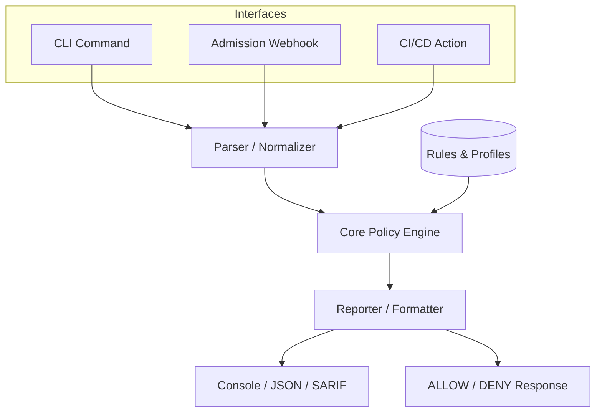

# Architecture

**Author**: Shaikh Mohammed Burhan (GitHub: NexusForge21)

## High-Level Data Flow
KubeGuard utilizes a single, shared policy engine across all its interfaces to guarantee deterministic behavior.

## Component Flows

### 1. CLI Flow
`CLI` → `Parser (YAML)` → `Normalizer` → `PolicyEngine` → `Evaluate Rules` → `Findings` → `Reporter`

### 2. Admission Flow
`APIServer` → `AdmissionReview v1` → `KubeGuard Webhook` → `Normalizer` → `PolicyEngine` → `AdmissionResponse (ALLOW/DENY)`

### 3. CI/CD Flow
`Git Push` → `GitHub Actions` → `KubeGuard (CLI underlying)` → `SARIF/JSON Export` → Pipeline `PASS/WARN/BLOCK`

## Core Component Descriptions
- **Parser/Normalizer**: Standardizes inputs (YAML files, stdin, AdmissionReview objects) into KubeGuard's internal `NormalizedResource` format.
- **Policy Engine**: The single brain of KubeGuard. Takes a `NormalizedResource` and a `PolicyProfile` and runs the deterministic evaluation.
- **Rules Store**: Interface-based logic implementing security and reliability checks.
- **Reporter**: Formats findings into the appropriate output (Human-readable, JSON, SARIF, or AdmissionResponse).
